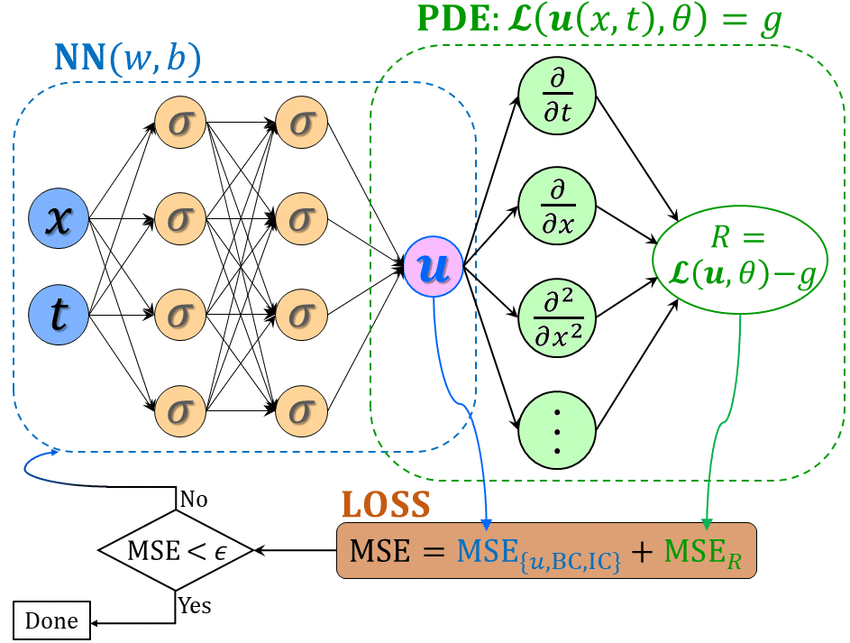
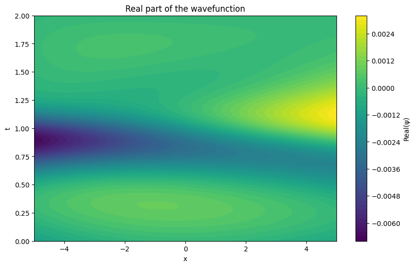
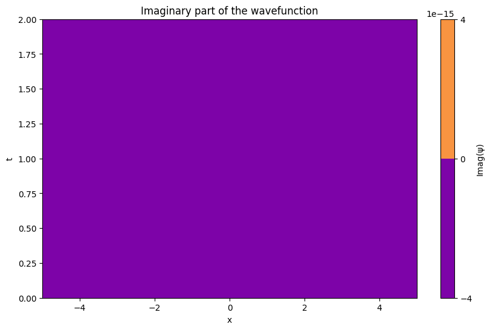
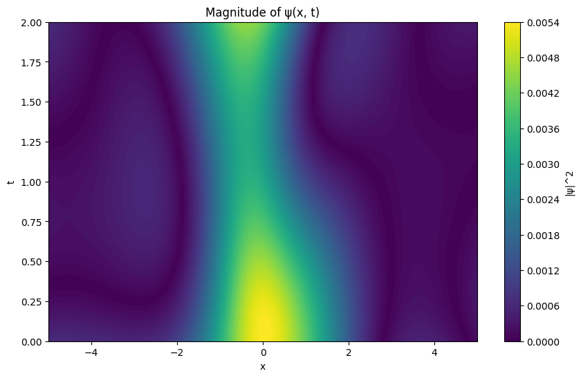

## What is Physics Informed Neural Network (PINN)?

Physics-informed neural networks (PINNs), also referred to as Theory-Trained Neural Networks (TTNs), are a type of universal function approximators that can embed the knowledge of any physical laws that govern a given data-set in the learning process, and can be described by partial differential equations (PDEs). Low data availability for some biological and engineering problems limit the robustness of conventional machine learning models used for these applications. The prior knowledge of general physical laws acts in the training of neural networks (NNs) as a regularization agent that limits the space of admissible solutions, increasing the generalizability of the function approximation. This way, embedding this prior information into a neural network results in enhancing the information content of the available data, facilitating the learning algorithm to capture the right solution and to generalize well even with a low amount of training examples.



_ _ _

## Why do we need PINN?

Physics-Informed Neural Networks (PINNs) are valuable because they:

1. Solve Complex PDEs: They provide an efficient way to solve partial differential equations (PDEs) without needing traditional discretization methods.
2. Integrate Physics: By embedding physical laws (like Schrödinger's equation) directly into the model, they require less data and enforce accuracy.
3. Handle Complex Geometries: PINNs can work with irregular domains and high-dimensional spaces without complex meshing.
4. Offer Scalability: They efficiently solve high-dimensional problems, which are challenging for traditional methods.
5. Improve Accuracy: PINNs can potentially yield more accurate solutions by learning directly from the physics.

_ _ _

# Schrodinger's Equation

The equation which we are going to be working upon

### $$-\frac{\hbar^2}{2m} \frac{\partial^2 \psi}{\partial x^2} + V\psi = i \hbar \frac{\partial \psi}{\partial t}$$
_ _ _

# Analysis of the model

this is the output we get when we run example.py

```
Epoch: 0, Loss: 2.3659284114837646
Epoch: 100, Loss: 0.0004947948618791997
Epoch: 200, Loss: 0.00017055866192094982
Epoch: 300, Loss: 0.00010282255243510008
Epoch: 400, Loss: 6.979628960834816e-05
Epoch: 500, Loss: 5.152115045348182e-05
Epoch: 600, Loss: 3.9741225918987766e-05
Epoch: 700, Loss: 3.146479502902366e-05
Epoch: 800, Loss: 2.536249485274311e-05
Epoch: 900, Loss: 2.069295987894293e-05

```

Now lets visualize the data 







### Also if you are interested what's happening between x, t and psi here are the results

```
Input: x = -5.00, t = 0.00 -> Prediction: ψ = -0.0012, Actual: ψ = -0.0000
Input: x = -4.90, t = 0.00 -> Prediction: ψ = -0.0011, Actual: ψ = -0.3120
Input: x = -4.80, t = 0.00 -> Prediction: ψ = -0.0010, Actual: ψ = -0.5929
Input: x = -4.70, t = 0.00 -> Prediction: ψ = -0.0009, Actual: ψ = -0.8146
Input: x = -4.60, t = 0.00 -> Prediction: ψ = -0.0008, Actual: ψ = -0.9549
Input: x = -4.49, t = 0.00 -> Prediction: ψ = -0.0007, Actual: ψ = -0.9999
Input: x = -4.39, t = 0.00 -> Prediction: ψ = -0.0006, Actual: ψ = -0.9450
Input: x = -4.29, t = 0.00 -> Prediction: ψ = -0.0005, Actual: ψ = -0.7958
Input: x = -4.19, t = 0.00 -> Prediction: ψ = -0.0004, Actual: ψ = -0.5671
Input: x = -4.09, t = 0.00 -> Prediction: ψ = -0.0003, Actual: ψ = -0.2817
Input: x = -3.99, t = 0.00 -> Prediction: ψ = -0.0003, Actual: ψ = 0.0317
Input: x = -3.89, t = 0.00 -> Prediction: ψ = -0.0002, Actual: ψ = 0.3420
Input: x = -3.79, t = 0.00 -> Prediction: ψ = -0.0001, Actual: ψ = 0.6182
Input: x = -3.69, t = 0.00 -> Prediction: ψ = -0.0001, Actual: ψ = 0.8326
Input: x = -3.59, t = 0.00 -> Prediction: ψ = -0.0000, Actual: ψ = 0.9638
Input: x = -3.48, t = 0.00 -> Prediction: ψ = -0.0000, Actual: ψ = 0.9989
Input: x = -3.38, t = 0.00 -> Prediction: ψ = 0.0000, Actual: ψ = 0.9341
```

these are a few relations that that were created by the model
